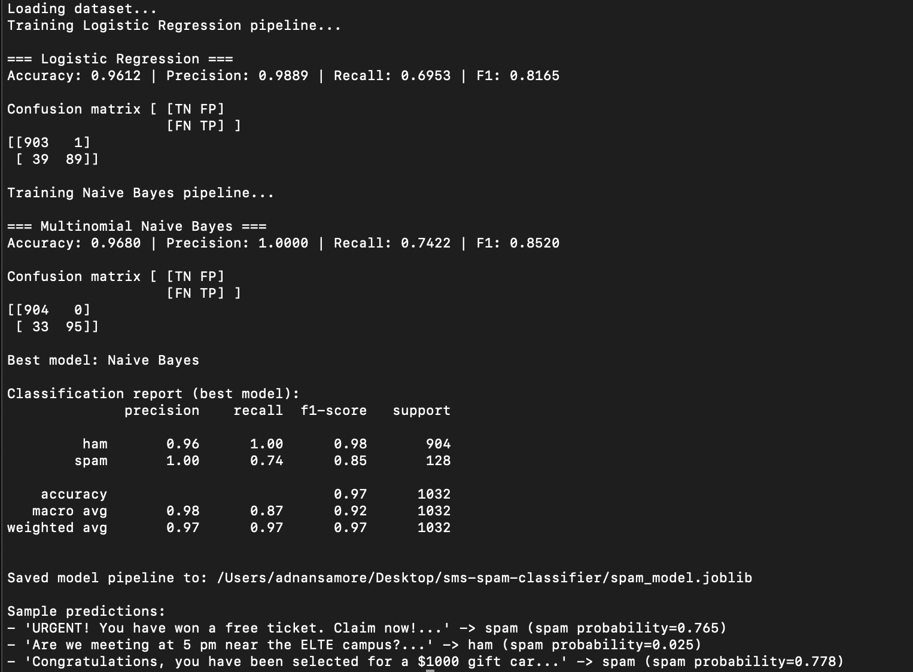

# SMS Spam Classifier

A machine learning project that classifies SMS messages as **Spam** or **Ham (Not Spam)** using Python and scikit-learn.  
The model was trained on the [SMS Spam Collection Dataset](https://www.kaggle.com/datasets/uciml/sms-spam-collection-dataset), achieving **97% accuracy**.

---

##  Features
- Preprocesses and cleans text data.
- Trains and compares **Logistic Regression** and **Naive Bayes** models.
- Saves the best model as a reusable pipeline (`spam_model.joblib`).
- Provides a script to make real-time predictions on new messages.

---

## Tech Stack
- **Python 3.9+**
- **pandas** for data handling
- **scikit-learn** for ML models
- **joblib** for model persistence

---

##  Project Structure
sms-spam-classifier/
-  ├── spam.csv # Dataset (from Kaggle)
-  ├── train_spam_classifier.py # Script to train and save model
-  ├── predict.py # Script to predict on new messages
-  ├── spam_model.joblib # Trained model (generated after training)
-  ├── requirements.txt # Project dependencies
-  └── README.md # Project documentation


---

## Installation

1. Clone the repository:
   ```bash
   git clone https://github.com/adnansamore/sms-spam-classifier.git
   cd sms-spam-classifier
   ```
2. Create and activate a virtual environment:

    ```bash
    python -m venv .venv
    source .venv/bin/activate   # Mac/Linux
    ```
    - If you are new to virtual environments, check out this guide I wrote:
        [Understanding Python Virtual Environments](https://adnansamore.github.io/posts/python-virtual-env/)

3. Install dependencies:
    ```bash
    pip install -r requirements.txt
    ```
4. Download the dataset from Kaggle
    - Place the spam.csv file inside the project folder.

## Training the Model
Run the training script:
```bash
    python train_spam_classifier.py --data_path spam.csv
```

This will:

- Train Logistic Regression and Naive Bayes models.
- Print accuracy, precision, recall, F1 score.
- Save the best model as spam_model.joblib.



## Results

- Best model: Naive Bayes
- Accuracy: 97%
- Precision: 1.00
- Recall: 0.74
- F1 Score: 0.85

## Author

Adnan Samore

- BSc Computer Science @ ELTE Budapest

- Passionate about AI, Cloud, and Software Development