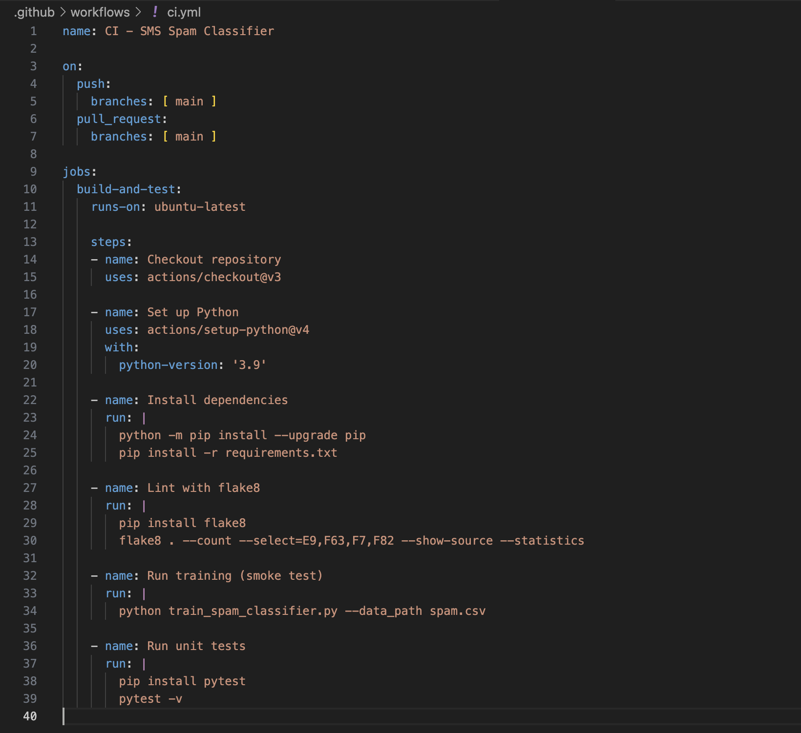

# SMS Spam Classifier

[](https://github.com/adnansamore/sms-spam-classifier/actions/workflows/ci.yml)

A machine learning project that classifies SMS messages as **Spam** or **Ham (Not Spam)** using Python and scikit-learn.  
The model was trained on the [SMS Spam Collection Dataset](https://www.kaggle.com/datasets/uciml/sms-spam-collection-dataset), achieving **97% accuracy**.

---

## Features

- Preprocesses and cleans text data.
- Trains and compares **Logistic Regression** and **Naive Bayes** models.
- Saves the best model as a reusable pipeline (`spam_model.joblib`).
- Provides a script to make real-time predictions on new messages.
- Automated tests to ensure model predictions are correct.
- CI pipeline using GitHub Actions to run tests on every push or pull request.

---

## Tech Stack

- **Python 3.9+**
- **pandas** for data handling
- **scikit-learn** for ML models
- **joblib** for model persistence
- **pytest** for testing

---

##  Project Structure
sms-spam-classifier/
-  ├── spam.csv  (Dataset from Kaggle)
-  ├── train_spam_classifier.py (Script to train and save model)
-  ├── predict.py (Script to predict on new messages)
-  ├── spam_model.joblib  (Trained model generated after training)
-  ├── requirements.txt (Project dependencies)
-  ├── README.md (Project documentation)
-  ├── .github/workflows/ci.yml
-  |__ tests/test_predict.py


---

## Installation

1. Clone the repository:
   ```bash
   git clone https://github.com/adnansamore/sms-spam-classifier.git
   cd sms-spam-classifier
   ```
2. Create and activate a virtual environment:

    ```bash
    python -m venv .venv
    source .venv/bin/activate   # Mac/Linux
    ```
    - If you are new to virtual environments, check out this guide I wrote:
        [Understanding Python Virtual Environments](https://adnansamore.github.io/posts/python-virtual-env/)

3. Install dependencies:
    ```bash
    pip install -r requirements.txt
    ```
4. Download the dataset from Kaggle
    - Place the spam.csv file inside the project folder.

## Training the Model
Run the training script:
```bash
    python train_spam_classifier.py --data_path spam.csv
```

This will:

- Train Logistic Regression and Naive Bayes models.
- Print accuracy, precision, recall, F1 score.
- Save the best model as spam_model.joblib.


## Results

- Best model: Naive Bayes
- Accuracy: 97%
- Precision: 1.00
- Recall: 0.74
- F1 Score: 0.85

## Testing

Automated tests ensure the model works as expected.

    Tests are in tests/test_predict.py.

    Check that the model exists and that sample spam/ham messages are correctly classified.

- Run tests locally:
    ```bash
       pytest tests/test_predict.py
    ```

    Expected output:

    ```bash
        ========================= test session starts =========================
        collected 3 items

        tests/test_predict.py ...                                         [100%]

        ========================== 3 passed in 0.82s =========================
    ```

## Continuous Integration (CI) & GitHub Actions
    - A CI pipeline runs on GitHub Actions to automatically run tests on every push or pull request.

    - Workflow file: .github/workflows/ci.yml

    - Runs on Python 3.9

    - Installs dependencies from requirements.txt

    - Runs all tests using pytest

workflow:


The CI workflow ensures:

- The trained model exists.

- Predictions on sample messages are correct.

- Regression errors are caught automatically.


## Author

Adnan Samore

- BSc Computer Science @ ELTE Budapest

- Passionate about AI, Cloud, and Software Development]